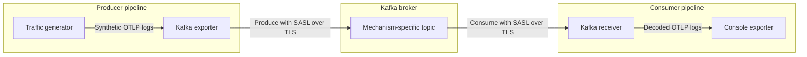

# Kafka Local Validation Scenarios

This example provides reusable Docker infrastructure for validating otel-arrow
Kafka exporter and receiver pipelines against a real Kafka broker. Pipeline
configurations live in `scenarios/`, and the setup helper selects the matching
Compose files and environment.

| Scenario | Flow |
| --- | --- |
| `auth` | Synthetic OTLP logs through three SASL-over-TLS mechanisms |
| `syslog` | RFC 5424 through parsed OTLP and raw rsyslog Kafka paths |
| `syslog-la` | Raw RFC 5424 through Kafka into Azure Log Analytics |

## Prerequisites

- Docker Desktop using Linux containers
- PowerShell

All components, including the Kafka-enabled dataflow engine, are built and run
in Docker.

## Set Up a Scenario

Run the following commands from `rust/otap-dataflow`:

```powershell
$ComposeArgs = & ./examples/kafka-e2e/scripts/Setup-KafkaE2E.ps1 -Scenario auth

docker compose @ComposeArgs config --quiet
if ($LASTEXITCODE -ne 0) {
  throw "Compose validation failed."
}
```

The helper sets `KAFKA_SCENARIO` and returns the Compose arguments without
starting containers. Run it again whenever switching scenarios:

```powershell
$ComposeArgs = & ./examples/kafka-e2e/scripts/Setup-KafkaE2E.ps1 -Scenario syslog
```

The `auth` and `syslog` scenarios use `compose.yaml` and
`compose.dataflow.yaml`. The `syslog-la` scenario also includes
`compose.azure.yaml`.

## Start the Selected Scenario

Start from an empty broker so its topics and data match the selected scenario:

```powershell
docker compose @ComposeArgs down -v
docker compose @ComposeArgs up -d --build
if ($LASTEXITCODE -ne 0) {
  throw "Kafka E2E stack startup failed."
}

docker compose @ComposeArgs ps
```

The first image build can take several minutes. Docker reuses the Cargo build
caches on later builds.

Open <http://127.0.0.1:8080/> to view the selected scenario's pipelines.

Open <http://127.0.0.1:8082/> to browse Kafka topics, messages, partitions,
consumer groups, offsets, and lag in Redpanda Console.

Follow the dataflow logs in another PowerShell terminal:

```powershell
docker compose `
  -f examples/kafka-e2e/compose.yaml `
  -f examples/kafka-e2e/compose.dataflow.yaml `
  logs --follow --no-color df-engine
```

Press `Ctrl-C` to stop following the logs without stopping the stack.

## Auth Scenario

### Authentication Flow

The default `auth` scenario sends OTLP protobuf logs through three independent
SASL-over-TLS paths:

| Mechanism | Topic | Consumer group |
| --- | --- | --- |
| `PLAIN` | `otlp-logs-plain` | `otap-plain-consumer` |
| `SCRAM-SHA-256` | `otlp-logs-scram-256` | `otap-scram-256-consumer` |
| `SCRAM-SHA-512` | `otlp-logs-scram-512` | `otap-scram-512-consumer` |

The configuration runs this path independently for `PLAIN`, `SCRAM-SHA-256`,
and `SCRAM-SHA-512`:



Each mechanism has a producer pipeline and a consumer pipeline, resulting in
the six pipelines shown in the admin portal:

- The traffic generator creates synthetic logs at five signals per second.
- The Kafka exporter encodes the logs as OTLP protobuf and authenticates to
  the broker.
- The Kafka receiver authenticates independently, consumes the matching topic,
  and decodes the OTLP protobuf messages.
- The console exporter prints the decoded logs.

SASL authentication is configured on each Kafka exporter and receiver. The
topics do not have authentication settings, and this example does not
configure Kafka ACLs. It validates client authentication, not per-topic
authorization.

The fixed credentials and generated certificates are for local development
only.

### Continuous Traffic

The auth scenario's traffic generators run continuously when
`KAFKA_MAX_SIGNAL_COUNT` is unset. Set the scenario and clear the limit before
using the shared startup steps:

```powershell
$ComposeArgs = & ./examples/kafka-e2e/scripts/Setup-KafkaE2E.ps1 -Scenario auth
Remove-Item Env:KAFKA_MAX_SIGNAL_COUNT -ErrorAction SilentlyContinue
```

The admin portal shows six pipelines. The dataflow logs contain repeated
`RESOURCE` and `SCOPE` entries emitted by the console exporters.

### Bounded Validation

Use a bounded run to produce 20 signals per authentication mechanism and
produce a finite console log that is easier to review:

```powershell
$ComposeArgs = & ./examples/kafka-e2e/scripts/Setup-KafkaE2E.ps1 -Scenario auth
$Env:KAFKA_MAX_SIGNAL_COUNT = "20"
```

Use the shared startup steps, wait for the generators to reach their limits,
then review the logs:

```powershell
Start-Sleep -Seconds 20
docker compose @ComposeArgs logs --no-color df-engine
```

### Authentication Verification

Confirm that the admin endpoint responds, all three Kafka receivers acquired
their partitions, and decoded telemetry reached the console exporters:

```powershell
$Response = Invoke-WebRequest http://127.0.0.1:8080/
if ($Response.StatusCode -ne 200) {
  throw "Admin portal did not return HTTP 200."
}

$Logs = docker compose @ComposeArgs logs --no-color df-engine
$ReceiverPipelines = @(
  "plain-consumer"
  "scram-256-consumer"
  "scram-512-consumer"
)

$ReceiverPipelines | ForEach-Object {
  $Pattern = "partitions_assigned.*pipeline.id=$([regex]::Escape($_))"
  if (-not ($Logs -match $Pattern)) {
    throw "No Kafka partition assignment found for $_."
  }
  Write-Host "PASS: $_ acquired its Kafka partition"
}

if (-not ($Logs -match "RESOURCE")) {
  throw "No decoded telemetry found in the console exporter output."
}
Write-Host "PASS: console exporters emitted decoded telemetry"
```

Repeated `RESOURCE` entries show that decoded telemetry reached the console
exporters. The three partition checks show that each authentication-specific
receiver connected to Kafka and acquired its topic partition.

To run the broker-only SASL/TLS preflight as an additional check:

```powershell
& ./examples/kafka-e2e/scripts/Test-KafkaAuth.ps1
```

This script verifies the broker handshake for all three mechanisms. It does
not exercise the otel-arrow exporter or receiver.

## Syslog Scenario

### Syslog Flow

The syslog scenario runs this path:

```text
UDP RFC 5424 -> syslog receiver -> Kafka exporter -> syslog-otlp-otel_arrow
             -> Kafka receiver -> console exporter

UDP RFC 5424 -> rsyslog -> syslog-raw-rsyslog
             -> Kafka receiver (Syslog decode) -> console exporter

UDP RFC 5424 -> Logstash plain input -> syslog-raw-logstash
             -> Kafka receiver (Syslog decode) -> console exporter

UDP RFC 5424 -> Logstash syslog input -> syslog-json-logstash
             -> Kafka receiver (OTLP decode attempt) -X-> console exporter

UDP RFC 5424 -> Logstash syslog input -> OTLP protobuf -> syslog-otlp-logstash
             -> Kafka receiver -> console exporter
```

The syslog receiver parses each message before the Kafka exporter encodes it
as OTLP protobuf. Kafka contains parsed OpenTelemetry logs, not the original
raw syslog payload. The rsyslog path publishes the original RFC 5424 message
to Kafka without using otel-arrow.

The Logstash plain-input path performs the same raw forwarding through an
independent implementation. Its UDP input uses the plain codec, and its Kafka
output explicitly formats only `%{message}` so Logstash does not prepend its
default timestamp and hostname.

The second Logstash path uses its syslog input to parse RFC 5424 fields and
publishes the resulting Logstash event as JSON. This shows the difference
between byte-preserving forwarding and Logstash-native syslog parsing.

The third Logstash path maps the parsed event into an OTLP
`ExportLogsServiceRequest`, encodes it with the protobuf codec, and publishes
the bytes directly to Kafka. The scenario builds `Dockerfile.logstash` to add
the codec and generate Ruby bindings from the repository's pinned
OpenTelemetry proto revision.

The raw rsyslog and Logstash consumers configure the Kafka receiver's `syslog`
encoding, which parses the original RFC 5424 payload into an OpenTelemetry log
record.

The JSON consumer intentionally configures `otlp_proto`. The Kafka receiver
forwards those bytes as an OTLP payload without eagerly validating the protobuf
wire format. The console exporter then emits
`console.logs_view.otlp_create_failed` with `InvalidProtobufWireFormat`. These
pipelines keep the unsupported JSON consumption path observable while both raw
Syslog and parsed OTLP paths succeed.

The standard rsyslog image does not include its Kafka output module. The
scenario builds `Dockerfile.rsyslog`, which adds the `rsyslog-kafka` package
and its `librdkafka` dependency to the pinned official image.

Select the scenario and use the shared startup steps:

```powershell
$ComposeArgs = & ./examples/kafka-e2e/scripts/Setup-KafkaE2E.ps1 -Scenario syslog
```

### Message Generation

Send one RFC 5424 message through otel-arrow:

```powershell
& ./examples/kafka-e2e/scripts/Send-Syslog.ps1 -Target OtelArrow
```

Send one RFC 5424 message directly through rsyslog:

```powershell
& ./examples/kafka-e2e/scripts/Send-Syslog.ps1 -Target Rsyslog
```

Send one RFC 5424 message through the Logstash plain input:

```powershell
& ./examples/kafka-e2e/scripts/Send-Syslog.ps1 -Target LogstashRaw
```

Send one RFC 5424 message through the Logstash syslog input:

```powershell
& ./examples/kafka-e2e/scripts/Send-Syslog.ps1 -Target LogstashJson
```

Send one RFC 5424 message as OTLP protobuf through Logstash:

```powershell
& ./examples/kafka-e2e/scripts/Send-Syslog.ps1 -Target LogstashOtlp
```

`OtelArrow` is the default target. All targets support custom content:

```powershell
& ./examples/kafka-e2e/scripts/Send-Syslog.ps1 -Target Rsyslog `
  -Message "application started"
```

Without `-Message`, the generated message includes the destination topic name
so records from different paths are easy to distinguish.

Generate continuous traffic through any target:

```powershell
& ./examples/kafka-e2e/scripts/Send-Syslog.ps1 -Target OtelArrow `
  -Continuous `
  -MessagesPerSecond 5
```

Press `Ctrl-C` to stop continuous generation.

### Syslog Verification

Open <http://127.0.0.1:8082/topics> in Redpanda Console. Confirm that the five
syslog topics are present, select a topic, and open its **Messages** tab to
inspect the records:

- `syslog-raw-rsyslog` and `syslog-raw-logstash` contain the original RFC 5424
  string.
- `syslog-json-logstash` contains the parsed Logstash event as JSON.
- `syslog-otlp-otel_arrow` and `syslog-otlp-logstash` contain OTLP protobuf
  `ExportLogsServiceRequest` messages and appear as binary data.

The **Consumer Groups** view can also be used to inspect group membership,
partition assignments, committed offsets, and lag.

To read the first record from a topic using the command line instead:

```powershell
$Topic = "syslog-raw-rsyslog"
# Other choices: syslog-raw-logstash, syslog-json-logstash,
#                syslog-otlp-otel_arrow, syslog-otlp-logstash
docker compose @ComposeArgs exec kafka `
  kafka-console-consumer `
  --bootstrap-server kafka:29092 `
  --topic $Topic `
  --from-beginning `
  --max-messages 1
```

The JSON messages are also offered to the corresponding otel-arrow consumer.
Confirm that its partition is assigned and the expected protobuf failure is
reported:

```powershell
[Console]::OutputEncoding = [Text.UTF8Encoding]::new()
$Logs = docker compose @ComposeArgs logs --no-color df-engine
$Logs | Select-String -Pattern `
  "pipeline.id=syslog-json-logstash-consumer", `
  "console.logs_view.otlp_create_failed", `
  "InvalidProtobufWireFormat"
```

The two raw Syslog and two OTLP topics are consumed successfully. Confirm that
all four topic partitions are assigned:

```powershell
$Logs | Select-String -Pattern `
  "partitions=syslog-raw-rsyslog:", `
  "partitions=syslog-raw-logstash:", `
  "partitions=syslog-otlp-otel_arrow:", `
  "partitions=syslog-otlp-logstash:"
```

Show each successful log record with its resource and scope:

```powershell
$Logs | Select-String -Pattern `
  "syslog.message=kafka-syslog-e2e-syslog-raw-rsyslog-", `
  "syslog.message=kafka-syslog-e2e-syslog-raw-logstash-", `
  "syslog.message=kafka-syslog-e2e-syslog-otlp-otel_arrow-", `
  "syslog.message=kafka-syslog-e2e-syslog-otlp-logstash-" `
  -Context 2,0
```

All four paths use empty resources and scopes and should contain matching
syslog attributes, including `input.format=rfc5424`.

## Log Analytics Scenario

The `syslog-la` scenario keeps RFC 5424 messages as raw bytes in Kafka and
exports them to an Azure Log Analytics custom table:

```text
UDP RFC 5424 -> rsyslog -> syslog-raw-rsyslog
             -> Kafka receiver (Syslog decoding) -> Azure Monitor exporter
```

The Azure overlay reuses the existing `syslog` broker setup, including its raw
rsyslog topic. It replaces only the dataflow configuration. The Kafka receiver
decodes the raw Syslog record because the Logs Ingestion API accepts JSON
records rather than raw wire bytes. No OTLP or OTAP encoding is used in Kafka.

This local-development flow authenticates as an Entra user through Azure CLI
inside the dataflow container. The CLI token cache is stored in a dedicated
Docker volume. For production deployments, use managed identity or workload
identity instead.

Set up the Log Analytics scenario:

```powershell
$ComposeArgs = & ./examples/kafka-e2e/scripts/Setup-KafkaE2E.ps1 -Scenario syslog-la
```

Build the Azure-enabled dataflow image:

```powershell
docker compose @ComposeArgs build df-engine
```

Sign in from the container. The script prints an authorization URL; open it in
the compliant host browser. Port `8400` returns the browser callback to the
container. This browser flow is required when Conditional Access blocks device
code authentication:

```powershell
$TenantId = "70a036f6-8e4d-4615-bad6-149c02e7720d"
$SubscriptionId = "74c8e62c-e50c-4289-ba32-8c59db23e24b"

docker compose @ComposeArgs run --rm --no-deps `
  -p 127.0.0.1:8400:8400 `
  --entrypoint /bin/bash df-engine `
  /scripts/login-azure.sh $TenantId $SubscriptionId
```

Provision the custom table and direct Data Collection Rule. This is a one-time
step for each workspace and resource set; skip it on later runs unless the
resources or template have changed. The deployment is idempotent, so rerunning
it is safe and can be used to repopulate `$Outputs` in a new PowerShell session.
Azure CLI automatically installs its integrated Bicep CLI when needed:

```powershell
$Deployment = docker compose @ComposeArgs run --rm --no-deps `
  --entrypoint az df-engine `
  deployment group create `
  --subscription $SubscriptionId `
  --resource-group bsap-test `
  --template-file /azure/main.bicep `
  --parameters workspaceName=bsap-laworkspace location=eastus `
  --output json | ConvertFrom-Json

$Outputs = $Deployment.properties.outputs
```

Set the dataflow configuration values from the deployment outputs:

```powershell
$Env:AZURE_MONITOR_DCR_ENDPOINT = $Outputs.dcrEndpoint.value
$Env:AZURE_MONITOR_DCR_ID = $Outputs.dcrId.value
$Env:AZURE_MONITOR_STREAM_NAME = $Outputs.streamName.value
```

Start the stack and send a raw Syslog message through rsyslog:

```powershell
docker compose @ComposeArgs up -d
& ./examples/kafka-e2e/scripts/Send-Syslog.ps1 -Target Rsyslog
```

Before checking Log Analytics, verify the source record in Kafka. Open
<http://127.0.0.1:8082/topics/syslog-raw-rsyslog> in Redpanda Console, select
the **Messages** tab, and inspect the newest record. Its value should be the
original RFC 5424 string and contain
`kafka-syslog-e2e-syslog-raw-rsyslog-`; it should not be JSON, OTLP, or OTAP.

After ingestion completes, query the custom table:

```powershell
docker compose @ComposeArgs run --rm --no-deps --entrypoint az df-engine `
  extension add --name log-analytics

docker compose @ComposeArgs run --rm --no-deps --entrypoint az df-engine `
  monitor log-analytics query `
  --workspace $Outputs.workspaceId.value `
  --analytics-query `
    "OtelArrowRawSyslog_CL | order by TimeGenerated desc | take 10" `
  --output table
```

You can also validate the output directly in the Azure portal. Open the
`bsap-laworkspace` Log Analytics workspace, select **Logs**, and run:

```kusto
OtelArrowRawSyslog_CL
| order by TimeGenerated desc
| take 10
```

The expected row has `Message` starting with
`kafka-syslog-e2e-syslog-raw-rsyslog-`, `HostName` set to `test-host`,
`AppName` set to `test-app`, and `InputFormat` set to `rfc5424`.

## Troubleshooting

Inspect service state and recent logs:

```powershell
docker compose @ComposeArgs ps --all
docker compose @ComposeArgs logs --no-color --tail 100 kafka
docker compose @ComposeArgs logs --no-color --tail 100 df-engine
docker compose @ComposeArgs logs --no-color --tail 100 rsyslog
docker compose @ComposeArgs logs --no-color --tail 100 logstash
```

If the Azure Monitor exporter receives `403 Forbidden`, verify that the user or
team security group has the `Monitoring Metrics Publisher` role on the DCR,
resource group, or subscription. An administrator can assign it directly to the
DCR when it is not inherited:

```powershell
docker compose @ComposeArgs run --rm --no-deps --entrypoint az df-engine `
  role assignment create `
  --assignee-object-id "<team-security-group-object-id>" `
  --assignee-principal-type Group `
  --role "Monitoring Metrics Publisher" `
  --scope $Outputs.dataCollectionRuleResourceId.value
```

If the auth scenario shows pipelines but no live traffic, confirm that the
`df-engine` service has `KAFKA_MAX_SIGNAL_COUNT=null`:

```powershell
docker compose @ComposeArgs config |
  Select-String -Pattern "KAFKA_MAX_SIGNAL_COUNT"
```

To rebuild the dataflow image after source changes:

```powershell
docker compose @ComposeArgs up -d --build --force-recreate df-engine
```

## Clean Up

Stop the stack and remove its broker data:

```powershell
docker compose @ComposeArgs down -v
Remove-Item Env:KAFKA_SCENARIO -ErrorAction SilentlyContinue
Remove-Item Env:KAFKA_MAX_SIGNAL_COUNT -ErrorAction SilentlyContinue
Remove-Item Env:AZURE_MONITOR_DCR_ENDPOINT -ErrorAction SilentlyContinue
Remove-Item Env:AZURE_MONITOR_DCR_ID -ErrorAction SilentlyContinue
Remove-Item Env:AZURE_MONITOR_STREAM_NAME -ErrorAction SilentlyContinue
```

For the Azure scenario, `down -v` also removes the sensitive Azure CLI token
cache. It does not delete the custom table, DCR, or Azure role assignment.

To also regenerate the local certificates on the next run:

```powershell
Remove-Item -Recurse -Force examples/kafka-e2e/certs `
  -ErrorAction SilentlyContinue
```
