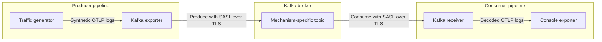

# Kafka Local Validation Scenarios

This example provides reusable Docker infrastructure for validating otel-arrow
Kafka exporter and receiver pipelines against a real Kafka broker. Pipeline
configurations live in `scenarios/` and are selected with the
`KAFKA_SCENARIO` environment variable.

| Scenario | Flow |
| --- | --- |
| `auth` | Synthetic OTLP logs through three SASL-over-TLS mechanisms |
| `syslog` | RFC 5424 through parsed OTLP and raw rsyslog Kafka paths |

## Prerequisites

- Docker Desktop using Linux containers
- PowerShell

All components, including the Kafka-enabled dataflow engine, are built and run
in Docker.

## Prepare the Stack

Run the following commands from `rust/otap-dataflow`:

```powershell
$ComposeFile = "examples/kafka-e2e/compose.yaml"
$DataflowComposeFile = "examples/kafka-e2e/compose.dataflow.yaml"
$ComposeArgs = @("-f", $ComposeFile, "-f", $DataflowComposeFile)

docker compose @ComposeArgs config --quiet
if ($LASTEXITCODE -ne 0) {
  throw "Compose validation failed."
}
```

Both Compose files are required for the end-to-end validation flows:

- `compose.yaml` defines certificate generation, Kafka, users, and topics.
- `compose.dataflow.yaml` adds the dataflow engine, admin portal,
  container-network settings, selectable scenario, and traffic limit.

The Compose override configures the broker address and certificate path for
the container network. It loads `scenarios/auth.yaml` by default.

## Select a Scenario

Leave `KAFKA_SCENARIO` unset to run the default `auth` scenario:

```powershell
Remove-Item Env:KAFKA_SCENARIO -ErrorAction SilentlyContinue
docker compose @ComposeArgs config --quiet
```

To select a scenario explicitly, set the variable to the scenario file name
without the `.yaml` extension:

```powershell
$Env:KAFKA_SCENARIO = "auth"
docker compose @ComposeArgs config --quiet
```

The selected file must exist under `scenarios/`. Scenario pipeline definitions,
required topics, input generation, and validation expectations should be
documented with that scenario.

## Start the Selected Scenario

Start from an empty broker so its topics and data match the selected scenario:

```powershell
docker compose @ComposeArgs down -v
docker compose @ComposeArgs up -d --build
if ($LASTEXITCODE -ne 0) {
  throw "Kafka E2E stack startup failed."
}

docker compose @ComposeArgs ps
```

The first image build can take several minutes. Docker reuses the Cargo build
caches on later builds.

Open <http://127.0.0.1:8080/> to view the selected scenario's pipelines.

Follow the dataflow logs in another PowerShell terminal:

```powershell
docker compose `
  -f examples/kafka-e2e/compose.yaml `
  -f examples/kafka-e2e/compose.dataflow.yaml `
  logs --follow --no-color df-engine
```

Press `Ctrl-C` to stop following the logs without stopping the stack.

## Auth Scenario

### Authentication Flow

The default `auth` scenario sends OTLP protobuf logs through three independent
SASL-over-TLS paths:

| Mechanism | Topic | Consumer group |
| --- | --- | --- |
| `PLAIN` | `otlp-logs-plain` | `otap-plain-consumer` |
| `SCRAM-SHA-256` | `otlp-logs-scram-256` | `otap-scram-256-consumer` |
| `SCRAM-SHA-512` | `otlp-logs-scram-512` | `otap-scram-512-consumer` |

The configuration runs this path independently for `PLAIN`, `SCRAM-SHA-256`,
and `SCRAM-SHA-512`:



Each mechanism has a producer pipeline and a consumer pipeline, resulting in
the six pipelines shown in the admin portal:

- The traffic generator creates synthetic logs at five signals per second.
- The Kafka exporter encodes the logs as OTLP protobuf and authenticates to
  the broker.
- The Kafka receiver authenticates independently, consumes the matching topic,
  and decodes the OTLP protobuf messages.
- The console exporter prints the decoded logs.

SASL authentication is configured on each Kafka exporter and receiver. The
topics do not have authentication settings, and this example does not
configure Kafka ACLs. It validates client authentication, not per-topic
authorization.

The fixed credentials and generated certificates are for local development
only.

### Continuous Traffic

The auth scenario's traffic generators run continuously when
`KAFKA_MAX_SIGNAL_COUNT` is unset. Set the scenario and clear the limit before
using the shared startup steps:

```powershell
$Env:KAFKA_SCENARIO = "auth"
Remove-Item Env:KAFKA_MAX_SIGNAL_COUNT -ErrorAction SilentlyContinue
```

The admin portal shows six pipelines. The dataflow logs contain repeated
`RESOURCE` and `SCOPE` entries emitted by the console exporters.

### Bounded Validation

Use a bounded run to produce 20 signals per authentication mechanism and
produce a finite console log that is easier to review:

```powershell
$Env:KAFKA_SCENARIO = "auth"
$Env:KAFKA_MAX_SIGNAL_COUNT = "20"
```

Use the shared startup steps, wait for the generators to reach their limits,
then review the logs:

```powershell
Start-Sleep -Seconds 20
docker compose @ComposeArgs logs --no-color df-engine
```

### Authentication Verification

Confirm that the admin endpoint responds, all three Kafka receivers acquired
their partitions, and decoded telemetry reached the console exporters:

```powershell
$Response = Invoke-WebRequest http://127.0.0.1:8080/
if ($Response.StatusCode -ne 200) {
  throw "Admin portal did not return HTTP 200."
}

$Logs = docker compose @ComposeArgs logs --no-color df-engine
$ReceiverPipelines = @(
  "plain-consumer"
  "scram-256-consumer"
  "scram-512-consumer"
)

$ReceiverPipelines | ForEach-Object {
  $Pattern = "partitions_assigned.*pipeline.id=$([regex]::Escape($_))"
  if (-not ($Logs -match $Pattern)) {
    throw "No Kafka partition assignment found for $_."
  }
  Write-Host "PASS: $_ acquired its Kafka partition"
}

if (-not ($Logs -match "RESOURCE")) {
  throw "No decoded telemetry found in the console exporter output."
}
Write-Host "PASS: console exporters emitted decoded telemetry"
```

Repeated `RESOURCE` entries show that decoded telemetry reached the console
exporters. The three partition checks show that each authentication-specific
receiver connected to Kafka and acquired its topic partition.

To run the broker-only SASL/TLS preflight as an additional check:

```powershell
& ./examples/kafka-e2e/scripts/Test-KafkaAuth.ps1
```

This script verifies the broker handshake for all three mechanisms. It does
not exercise the otel-arrow exporter or receiver.

## Syslog Scenario

### Syslog Flow

The syslog scenario runs this path:

```text
UDP RFC 5424 -> syslog receiver -> Kafka exporter -> syslog-logs
             -> Kafka receiver -> console exporter

UDP RFC 5424 -> rsyslog -> syslog-raw-rsyslog
             -> Kafka receiver (OTLP decode attempt) -X-> console exporter

UDP RFC 5424 -> Logstash -> syslog-raw-logstash
             -> Kafka receiver (OTLP decode attempt) -X-> console exporter
```

The syslog receiver parses each message before the Kafka exporter encodes it
as OTLP protobuf. Kafka contains parsed OpenTelemetry logs, not the original
raw syslog payload. The rsyslog path publishes the original RFC 5424 message
to Kafka without using otel-arrow.

The Logstash path performs the same raw forwarding through an independent
implementation. Its UDP input uses the plain codec, and its Kafka output
explicitly formats only `%{message}` so Logstash does not prepend its default
timestamp and hostname.

The raw consumer intentionally configures `otlp_proto`, the only applicable
Kafka log encoding currently available. The Kafka receiver forwards the bytes
as an OTLP payload without eagerly validating the protobuf wire format. The
console exporter then emits `console.logs_view.otlp_create_failed` with
`InvalidProtobufWireFormat`. This pipeline makes the unsupported raw-syslog
consumption path observable while keeping the engine and parsed OTLP path
running.

The standard rsyslog image does not include its Kafka output module. The
scenario builds `Dockerfile.rsyslog`, which adds the `rsyslog-kafka` package
and its `librdkafka` dependency to the pinned official image.

Select the scenario and use the shared startup steps:

```powershell
$Env:KAFKA_SCENARIO = "syslog"
```

### Message Generation

Send one RFC 5424 message through otel-arrow:

```powershell
& ./examples/kafka-e2e/scripts/Send-Syslog.ps1 -Target OtelArrow
```

Send one RFC 5424 message directly through rsyslog:

```powershell
& ./examples/kafka-e2e/scripts/Send-Syslog.ps1 -Target Rsyslog
```

Send one RFC 5424 message directly through Logstash:

```powershell
& ./examples/kafka-e2e/scripts/Send-Syslog.ps1 -Target Logstash
```

`OtelArrow` is the default target. All targets support custom content:

```powershell
& ./examples/kafka-e2e/scripts/Send-Syslog.ps1 -Target Rsyslog `
  -Message "application started"
```

Generate continuous traffic through any target:

```powershell
& ./examples/kafka-e2e/scripts/Send-Syslog.ps1 -Target OtelArrow `
  -Continuous `
  -MessagesPerSecond 5
```

Press `Ctrl-C` to stop continuous generation.

### Syslog Verification

For the otel-arrow target, verify that the dataflow logs contain the printed
message marker, `input.format` set to `rfc5424`, and `syslog.app_name` set to
`test-app`.

For the rsyslog and Logstash targets, read the original messages from Kafka:

```powershell
$RawTopics = @("syslog-raw-rsyslog", "syslog-raw-logstash")
$RawTopics | ForEach-Object {
  docker compose @ComposeArgs exec kafka `
    kafka-console-consumer `
    --bootstrap-server kafka:29092 `
    --topic $_ `
    --from-beginning `
    --max-messages 1
}
```

The raw messages are also offered to the corresponding otel-arrow consumers.
Confirm that their partitions are assigned and the expected protobuf failures
are reported:

```powershell
$Logs = docker compose @ComposeArgs logs --no-color df-engine
$Logs | Select-String -Pattern `
  "pipeline.id=syslog-raw-rsyslog-consumer", `
  "pipeline.id=syslog-raw-logstash-consumer", `
  "console.logs_view.otlp_create_failed", `
  "InvalidProtobufWireFormat"
```

## Troubleshooting

Inspect service state and recent logs:

```powershell
docker compose @ComposeArgs ps --all
docker compose @ComposeArgs logs --no-color --tail 100 kafka
docker compose @ComposeArgs logs --no-color --tail 100 df-engine
docker compose @ComposeArgs logs --no-color --tail 100 rsyslog
docker compose @ComposeArgs logs --no-color --tail 100 logstash
```

If the auth scenario shows pipelines but no live traffic, confirm that the
`df-engine` service has `KAFKA_MAX_SIGNAL_COUNT=null`:

```powershell
docker compose @ComposeArgs config |
  Select-String -Pattern "KAFKA_MAX_SIGNAL_COUNT"
```

To rebuild the dataflow image after source changes:

```powershell
docker compose @ComposeArgs up -d --build --force-recreate df-engine
```

## Clean Up

Stop the stack and remove its broker data:

```powershell
docker compose @ComposeArgs down -v
Remove-Item Env:KAFKA_SCENARIO -ErrorAction SilentlyContinue
Remove-Item Env:KAFKA_MAX_SIGNAL_COUNT -ErrorAction SilentlyContinue
```

To also regenerate the local certificates on the next run:

```powershell
Remove-Item -Recurse -Force examples/kafka-e2e/certs `
  -ErrorAction SilentlyContinue
```
