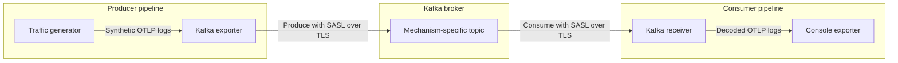

# Kafka SASL over TLS Local Validation

This example validates the otel-arrow Kafka exporter and receiver against a
real Kafka broker. It sends OTLP protobuf logs through three independent
SASL-over-TLS paths:

| Mechanism | Topic | Consumer group |
| --- | --- | --- |
| `PLAIN` | `otlp-logs-plain` | `otap-plain-consumer` |
| `SCRAM-SHA-256` | `otlp-logs-scram-256` | `otap-scram-256-consumer` |
| `SCRAM-SHA-512` | `otlp-logs-scram-512` | `otap-scram-512-consumer` |

## End-to-End Validation Flow

The configuration runs this path independently for `PLAIN`, `SCRAM-SHA-256`,
and `SCRAM-SHA-512`:



Each mechanism has a producer pipeline and a consumer pipeline, resulting in
the six pipelines shown in the admin portal:

- The traffic generator creates synthetic logs at five signals per second.
- The Kafka exporter encodes the logs as OTLP protobuf and authenticates to
  the broker.
- The Kafka receiver authenticates independently, consumes the matching topic,
  and decodes the OTLP protobuf messages.
- The console exporter prints the decoded logs.

SASL authentication is configured on each Kafka exporter and receiver. The
topics do not have authentication settings, and this example does not
configure Kafka ACLs. It validates client authentication, not per-topic
authorization.

The fixed credentials and generated certificates are for local development
only.

## Prerequisites

- Docker Desktop using Linux containers
- PowerShell

All components, including the Kafka-enabled dataflow engine, are built and run
in Docker.

## Prepare the Stack

Run the following commands from `rust/otap-dataflow`:

```powershell
$ComposeFile = "examples/kafka-sasl-tls/compose.yaml"
$DataflowComposeFile = "examples/kafka-sasl-tls/compose.dataflow.yaml"
$ComposeArgs = @("-f", $ComposeFile, "-f", $DataflowComposeFile)

docker compose @ComposeArgs config --quiet
if ($LASTEXITCODE -ne 0) {
  throw "Compose validation failed."
}
```

Both Compose files are required for the end-to-end validation flows:

- `compose.yaml` defines certificate generation, Kafka, users, and topics.
- `compose.dataflow.yaml` adds the dataflow engine, admin portal,
  container-network settings, and selectable traffic limit.

The Compose override configures the broker address and certificate path for
the container network. Choose one of the validation flows below before
starting the stack.

The first image build can take several minutes. Docker reuses the Cargo build
caches on later builds.

## Continuous Validation with the Admin Portal

Use continuous traffic to observe all six pipelines in the admin portal. Clear
any prior limit and start the stack:

```powershell
Remove-Item Env:KAFKA_MAX_SIGNAL_COUNT -ErrorAction SilentlyContinue

docker compose @ComposeArgs up -d --build
if ($LASTEXITCODE -ne 0) {
  throw "Kafka SASL/TLS stack startup failed."
}

docker compose @ComposeArgs ps
```

Open <http://127.0.0.1:8080/> to view the six pipelines and their live traffic.

In another PowerShell terminal, follow the dataflow logs to see the decoded
telemetry emitted by the console exporters at the end of the receiver
pipelines:

```powershell
docker compose `
  -f examples/kafka-sasl-tls/compose.yaml `
  -f examples/kafka-sasl-tls/compose.dataflow.yaml `
  logs --follow --no-color df-engine
```

Look for repeated `RESOURCE` and `SCOPE` entries. Press `Ctrl-C` to stop
following the logs without stopping the stack.

## Bounded Validation in the Console

Use a bounded run to produce 20 signals per authentication mechanism and
produce a finite console log that is easier to review. Start from an empty
broker so the output only represents the current run:

```powershell
docker compose @ComposeArgs down -v
$Env:KAFKA_MAX_SIGNAL_COUNT = "20"

docker compose @ComposeArgs up -d --build
if ($LASTEXITCODE -ne 0) {
  throw "Kafka SASL/TLS stack startup failed."
}
Start-Sleep -Seconds 20
docker compose @ComposeArgs logs --no-color df-engine
```

The dataflow engine remains running after the generators reach their limits.
Review the output for the three partition assignments and the finite set of
decoded `RESOURCE` and `SCOPE` entries.

Remove the environment override before returning to continuous validation:

```powershell
Remove-Item Env:KAFKA_MAX_SIGNAL_COUNT -ErrorAction SilentlyContinue
```

## Verify Either Flow

Confirm that the admin endpoint responds, all three Kafka receivers acquired
their partitions, and decoded telemetry reached the console exporters:

```powershell
$Response = Invoke-WebRequest http://127.0.0.1:8080/
if ($Response.StatusCode -ne 200) {
  throw "Admin portal did not return HTTP 200."
}

$Logs = docker compose @ComposeArgs logs --no-color df-engine
$ReceiverPipelines = @(
  "plain-consumer"
  "scram-256-consumer"
  "scram-512-consumer"
)

$ReceiverPipelines | ForEach-Object {
  $Pattern = "partitions_assigned.*pipeline.id=$([regex]::Escape($_))"
  if (-not ($Logs -match $Pattern)) {
    throw "No Kafka partition assignment found for $_."
  }
  Write-Host "PASS: $_ acquired its Kafka partition"
}

if (-not ($Logs -match "RESOURCE")) {
  throw "No decoded telemetry found in the console exporter output."
}
Write-Host "PASS: console exporters emitted decoded telemetry"
```

Repeated `RESOURCE` entries show that decoded telemetry reached the console
exporters. The three partition checks show that each authentication-specific
receiver connected to Kafka and acquired its topic partition.

To run the broker-only SASL/TLS preflight as an additional check:

```powershell
& ./examples/kafka-sasl-tls/scripts/Test-KafkaAuth.ps1
```

This script verifies the broker handshake for all three mechanisms. It does
not exercise the otel-arrow exporter or receiver.

## Troubleshooting

Inspect service state and recent logs:

```powershell
docker compose @ComposeArgs ps --all
docker compose @ComposeArgs logs --no-color --tail 100 kafka
docker compose @ComposeArgs logs --no-color --tail 100 df-engine
```

If the portal shows the pipelines but no live traffic, confirm that the
`df-engine` service has `KAFKA_MAX_SIGNAL_COUNT=null`:

```powershell
docker compose @ComposeArgs config |
  Select-String -Pattern "KAFKA_MAX_SIGNAL_COUNT"
```

To rebuild the dataflow image after source changes:

```powershell
docker compose @ComposeArgs up -d --build --force-recreate df-engine
```

## Clean Up

Stop the stack and remove its broker data:

```powershell
docker compose @ComposeArgs down -v
Remove-Item Env:KAFKA_MAX_SIGNAL_COUNT -ErrorAction SilentlyContinue
```

To also regenerate the local certificates on the next run:

```powershell
Remove-Item -Recurse -Force examples/kafka-sasl-tls/certs `
  -ErrorAction SilentlyContinue
```
